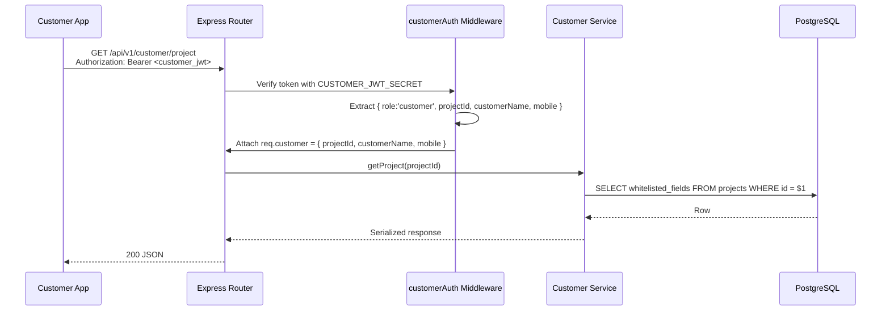
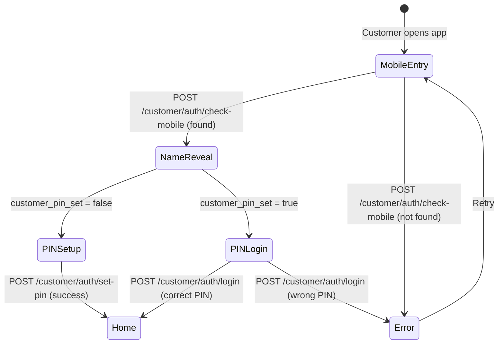

# Design Document: Customer Portal

## Overview

The Customer Portal adds a customer-facing project tracking interface to the ICMS application. It provides a completely separate authentication path (mobile + 4-digit PIN), separate JWT signing (`CUSTOMER_JWT_SECRET`), and a dedicated set of read-only API endpoints prefixed with `/customer/`. The frontend is a new Flutter ShellRoute with seven tabs (Home, Timeline, Photos, Drawings, Payments, Messages, Notifications) deployed as a PWA on Hostinger (`client.metalandmore.in`) and bundled in the existing Android APK.

### Key Design Decisions

1. **Separate JWT secret** — Customer tokens are signed with `CUSTOMER_JWT_SECRET`, ensuring staff middleware rejects customer tokens and vice versa. No shared auth state.
2. **Project-scoped identity** — A customer JWT encodes `projectId` directly. All queries use this single ID; no user table row exists for customers.
3. **Additive-only schema** — New columns on `projects` + two new tables (`customer_notifications`, `customer_messages`). No modifications to existing constraints.
4. **No refresh tokens for customers** — Customer JWTs have a 30-day expiry. Simplifies the mobile UX (no silent refresh logic needed).
5. **Field whitelist approach** — Each endpoint explicitly selects allowed columns rather than stripping from a full row, preventing accidental data leaks.
6. **Photos from daily_reports** — Customer photos are extracted from daily report file attachments (via `files` table with `report_id`), not a separate customer photos table. Latest 50 shown.
7. **Drawings from files table** — Only `approval_status = 'approved'` drawings shown to customer.
8. **Customer cannot reset own PIN** — Only admin can reset. Customer has no "forgot PIN" flow.
9. **Admin posts messages via staff routes** — `POST /projects/:id/customer-message` uses existing staff auth, not customer auth routes.
10. **Dual deployment** — PWA on Hostinger (client.metalandmore.in) with `.htaccess` SPA routing + Android APK with staff login as default entry.

---

## Architecture

### High-Level System Diagram

```mermaid
flowchart TD
    subgraph "Flutter Client (PWA / Android)"
        CL[Customer Login Screen<br/>3-step: Mobile → Name Reveal → PIN]
        CS[Customer Shell<br/>Home | Timeline | Photos | Drawings | Payments | Messages | Notifications]
        ST[Staff Screens<br/>Existing Admin/Supervisor/Worker]
    end

    subgraph "Backend (Node/Express) — api.metalandmore.in"
        CA[Customer Auth Routes<br/>/api/v1/customer/auth/*]
        CD[Customer Data Routes<br/>/api/v1/customer/*]
        AM[Admin Message Route<br/>POST /projects/:id/customer-message]
        SA[Staff Auth & Routes<br/>/api/v1/auth + all existing]
        CM[customerAuth Middleware<br/>verifies CUSTOMER_JWT_SECRET]
        SM[authenticate Middleware<br/>verifies JWT_SECRET]
    end

    subgraph "PostgreSQL"
        PT[(projects table<br/>+ customer columns)]
        CN[(customer_notifications<br/>+ type column)]
        CMT[(customer_messages<br/>message + media)]
        DR[(daily_reports + files<br/>photos source)]
        FT[(files<br/>drawings source)]
        PSH[(project_stage_history<br/>timeline source)]
        PAY[(payments<br/>payment source)]
    end

    CL -->|POST check-mobile, set-pin, login| CA
    CS -->|GET /customer/me, project, project/*| CD
    AM -->|staff auth| SM
    ST -->|existing flows| SA

    CA --> PT
    CD -->|customerAuth| CM
    CD --> PT
    CD --> CN
    CD --> CMT
    CD --> DR
    CD --> FT
    CD --> PSH
    CD --> PAY
    AM --> CMT
    SA -->|authenticate| SM
```

### Request Flow



### Authentication Flow (3-Step Login)



---

## Components and Interfaces

### Backend Components

#### 1. Customer Module (`src/modules/customer/`)

| File | Responsibility |
|------|---------------|
| `045_customer_portal.sql` | Migration: customer columns on projects + customer_notifications + customer_messages tables |
| `customer.routes.js` | Route definitions for `/customer/auth/*`, `/customer/*` data, and admin message endpoint |
| `customer.service.js` | Business logic: mobile lookup, PIN hash/verify, JWT issue, data queries (getProject, getTimeline, getPhotos, getDrawings, getPayments, getMessages, getNotifications) |
| `customer.middleware.js` | `customerAuth` middleware — verifies CUSTOMER_JWT_SECRET, attaches `req.customer` |

#### 2. Customer Auth Middleware (`src/modules/customer/customer.middleware.js`)

```javascript
// Pseudocode
const jwt = require('jsonwebtoken');

async function customerAuth(req, res, next) {
  const header = req.headers.authorization || '';
  const [scheme, token] = header.split(' ');
  if (scheme !== 'Bearer' || !token) throw unauthorized();
  
  const payload = jwt.verify(token, process.env.CUSTOMER_JWT_SECRET);
  if (payload.role !== 'customer') throw unauthorized();
  
  req.customer = {
    projectId: payload.projectId,
    customerName: payload.customerName,
    mobile: payload.mobile,
  };
  next();
}
```

#### 3. Customer Rate Limiters (within `customer.routes.js`)

```javascript
const customerLoginLimiter = rateLimit({
  windowMs: 15 * 60 * 1000,  // 15 minutes
  max: 5,
  keyGenerator: (req) => req.body.mobile || req.ip,
  message: { error: { code: 'RATE_LIMITED', message: 'Too many login attempts' } },
});

const customerCheckMobileLimiter = rateLimit({
  windowMs: 15 * 60 * 1000,
  max: 10,
  // Per-IP (default keyGenerator)
  message: { error: { code: 'RATE_LIMITED', message: 'Too many attempts' } },
});
```

#### 4. Admin Customer Message Endpoint (on existing staff routes)

- `POST /api/v1/projects/:id/customer-message` — admin posts message to customer (uses existing staff `authenticate` + `requireRole('admin')`)

### API Endpoint Summary

| Method | Path | Auth | Description |
|--------|------|------|-------------|
| POST | `/customer/auth/check-mobile` | None | Lookup project by mobile, return name + pin status |
| POST | `/customer/auth/set-pin` | None | First-time PIN creation |
| POST | `/customer/auth/login` | None | Mobile + PIN → Customer JWT |
| GET | `/customer/me` | customerAuth | Customer profile info (name, mobile, project_name) |
| GET | `/customer/project` | customerAuth | Project overview (whitelisted fields) |
| GET | `/customer/project/timeline` | customerAuth | 13-stage timeline from project_stage_history |
| GET | `/customer/project/photos` | customerAuth | Site photos (latest 50 from daily_reports) |
| GET | `/customer/project/drawings` | customerAuth | Approved drawings only |
| GET | `/customer/project/payments` | customerAuth | Payment summary totals |
| GET | `/customer/notifications` | customerAuth | Customer notifications list |
| PUT | `/customer/notifications/:id/read` | customerAuth | Mark notification as read |
| GET | `/customer/messages` | customerAuth | Admin messages/announcements |
| PUT | `/customer/messages/:id/read` | customerAuth | Mark message as read |
| POST | `/projects/:id/customer-message` | staff auth (admin) | Post message to customer |
| POST | `/customer/admin/reset-pin` | staff auth (admin) | Reset customer PIN |

### Service Layer Methods

#### `getProject(projectId)`

Returns whitelisted project fields:
```json
{
  "project_name": "Villa Renovation",
  "site_name": "MG Road Site",
  "site_address": "123 MG Road, Hyderabad",
  "progress_percentage": 65,
  "current_stage": "installation",
  "stage_label": "Installation",
  "expected_completion_date": "2024-06-30",
  "project_start_date": "2024-01-15",
  "customer_name": "Rahul Sharma",
  "supervisor_name": "Vijay Kumar",
  "supervisor_phone": "+919876543210",
  "weekly_status": "on_track",
  "project_health": "on_track"
}
```

#### `getTimeline(projectId)`

Reads from `project_stage_history` — returns all 13 stages with status:
```json
{
  "stages": [
    {
      "stage": "discussion",
      "stage_label": "Discussion",
      "entered_at": "2024-01-10T10:00:00Z",
      "completed_at": "2024-01-15T14:00:00Z",
      "is_current": false
    },
    {
      "stage": "installation",
      "stage_label": "Installation",
      "entered_at": "2024-05-01T09:00:00Z",
      "completed_at": null,
      "is_current": true
    }
  ]
}
```

#### `getPhotos(projectId)`

Reads from `files` table where `report_id IS NOT NULL` and `category = 'photo'` — returns latest 50:
```json
{
  "photos": [
    {
      "id": "uuid",
      "url": "https://api.metalandmore.in/api/v1/files/uuid/download",
      "uploaded_by_name": "Vijay Kumar",
      "date": "2024-03-15T10:30:00Z"
    }
  ]
}
```

#### `getPayments(projectId)`

Returns summary from `payments` table:
```json
{
  "total_quoted": 500000,
  "total_received": 200000,
  "outstanding": 300000,
  "payment_count": 3
}
```

### Frontend Components

#### 1. Customer Feature (`lib/features/customer/`)

Directory structure:
```
features/customer/
├── data/
│   └── customer_api.dart           # Dio calls to /customer/* endpoints
├── providers/
│   └── customer_providers.dart     # Riverpod providers for all customer data
├── presentation/
│   ├── customer_login_screen.dart  # 3-step login (mobile → name → PIN)
│   ├── customer_set_pin_screen.dart # First-time PIN setup
│   ├── customer_shell.dart         # Bottom nav wrapper
│   ├── customer_home_screen.dart   # Hero card, sections
│   ├── customer_timeline_screen.dart # Apple-style delivery tracking
│   ├── customer_photos_screen.dart # Masonry grid + full-screen view
│   ├── customer_drawings_screen.dart # Approved drawings with green badge
│   ├── customer_payments_screen.dart # Circular progress + summary
│   ├── customer_messages_screen.dart # Admin messages with media
│   └── customer_notifications_screen.dart # Notification list
└── widgets/
    ├── custom_numpad.dart          # Custom numeric keypad widget
    ├── pin_dots.dart               # 4-dot PIN indicator with animation
    ├── hero_welcome_card.dart      # Gradient progress card
    └── stage_strip.dart            # Horizontal stage progression strip
```

#### 2. Customer Login Screen — 3-Step Flow

**Step 1: Mobile Entry**
- Gradient background: `#00D1DC` → `#0097A7`
- Glass card effect (frosted glass container)
- Mobile number input with +91 prefix
- Submit triggers `check-mobile` API call

**Step 2: Name Reveal Animation**
- On success, customer name animates in (scale + fade)
- Displays "Welcome, {customerName}"
- Auto-transitions to PIN input after 1.5s

**Step 3: PIN Login / PIN Setup**
- Custom numpad (no system keyboard)
- 4 dot circles for PIN entry with scale animation on fill
- If `pinSet = false` → navigate to CustomerSetPinScreen
- If `pinSet = true` → verify PIN inline

#### 3. Customer Home Screen

```dart
// Structure: CustomScrollView with SliverAppBar
CustomScrollView(
  slivers: [
    SliverAppBar(/* expandedHeight: 200, gradient background */),
    // Hero Welcome Card
    //   - Gradient card (#00D1DC → #0097A7)
    //   - Animated circular progress indicator (AnimatedBuilder)
    //   - Project name + current stage label
    //   - Progress percentage in center
    
    // Today at Site section
    //   - Weekly status chip + supervisor info
    
    // Latest Photos section
    //   - Horizontal scroll (SizedBox height: 120)
    //   - Rounded corners, tap to full-screen
    
    // Project Stage section
    //   - Compact horizontal strip showing 13 stages
    //   - Current stage highlighted with pulsing dot
    
    // Payment Summary section
    //   - Total quoted, received, outstanding
    //   - Linear progress bar
    
    // Messages from Team section
    //   - Latest 3 unread messages
    //   - Tap to navigate to messages screen
  ],
)
```

#### 4. Customer Timeline Screen (Apple Delivery Tracking Style)

- Vertical timeline with connecting line
- Pulsing animation on current stage indicator
- Staggered entrance animation: 80ms delay per stage item
- Completed stages: green check icon, date shown
- Current stage: pulsing teal dot, "In Progress" label
- Upcoming stages: grey dot, dimmed text
- Celebration card (confetti-style) shown at project completion

#### 5. Customer Photos Screen

- Masonry grid layout grouped by date headers
- Uses `photo_view` package for full-screen pinch-to-zoom
- Shows `uploaded_by_name` and date below each photo
- Pull-to-refresh for latest photos

#### 6. Customer Drawings Screen

- List view of approved drawings only
- Green "Approved" badge on each item
- Tap opens PDF viewer (`/viewer` route)
- Shows version number and approval date

#### 7. Customer Payments Screen

- Circular progress chart (received / total quoted)
- Summary bars: Total Quoted, Received, Outstanding
- Payment count displayed
- No individual transaction details exposed

#### 8. Customer Messages Screen

- List of admin announcements
- Supports media attachments (images, documents, voice notes)
- `media_url` + `media_type` displayed inline
- Mark-as-read on view (PUT `/customer/messages/:id/read`)
- Ordered by created_at descending

#### 9. Router Integration (`core/router/app_router.dart`)

New `ShellRoute` added for customer paths:

```dart
// Customer auth routes (outside shell, no bottom nav)
GoRoute(path: '/customer-login', builder: (_, __) => const CustomerLoginScreen()),
GoRoute(path: '/customer-set-pin', builder: (_, __) => const CustomerSetPinScreen()),

// Customer shell with bottom navigation
ShellRoute(
  builder: (_, state, child) => CustomerShell(child: child),
  routes: [
    GoRoute(path: '/customer', builder: (_, __) => const CustomerHomeScreen()),
    GoRoute(path: '/customer/timeline', builder: (_, __) => const CustomerTimelineScreen()),
    GoRoute(path: '/customer/photos', builder: (_, __) => const CustomerPhotosScreen()),
    GoRoute(path: '/customer/drawings', builder: (_, __) => const CustomerDrawingsScreen()),
    GoRoute(path: '/customer/payments', builder: (_, __) => const CustomerPaymentsScreen()),
    GoRoute(path: '/customer/messages', builder: (_, __) => const CustomerMessagesScreen()),
    GoRoute(path: '/customer/notifications', builder: (_, __) => const CustomerNotificationsScreen()),
  ],
)
```

**Platform-specific defaults:**
- Web (`kIsWeb`): When no customer token stored → default to `/customer-login`
- Android: Maintains existing staff login as default entry point

#### 10. Customer Dio Client

Separate Dio instance (or interceptor switch) reading from `customer_access_token` storage key:
- Base URL: `https://api.metalandmore.in/api/v1`
- No refresh token logic — on 401 → clear token → redirect to `/customer-login`

---

## Data Models

### Migration 045: Customer Portal Schema (Updated)

```sql
-- 045_customer_portal.sql
-- Customer Portal: auth columns on projects + notifications + messages tables

-- Add customer auth columns to projects
ALTER TABLE projects
  ADD COLUMN IF NOT EXISTS customer_mobile TEXT,
  ADD COLUMN IF NOT EXISTS customer_mobile_alt TEXT,
  ADD COLUMN IF NOT EXISTS customer_pin_hash TEXT,
  ADD COLUMN IF NOT EXISTS customer_pin_set BOOLEAN NOT NULL DEFAULT false,
  ADD COLUMN IF NOT EXISTS customer_last_login TIMESTAMPTZ;

-- Index for mobile lookup
CREATE INDEX IF NOT EXISTS idx_projects_customer_mobile
  ON projects(customer_mobile) WHERE customer_mobile IS NOT NULL;

-- Customer notifications table
CREATE TABLE IF NOT EXISTS customer_notifications (
  id          UUID PRIMARY KEY DEFAULT gen_random_uuid(),
  project_id  UUID NOT NULL REFERENCES projects(id) ON DELETE CASCADE,
  title       TEXT NOT NULL,
  body        TEXT NOT NULL,
  type        TEXT NOT NULL DEFAULT 'info'
              CHECK (type IN ('info', 'milestone', 'payment', 'photo', 'announcement')),
  is_read     BOOLEAN NOT NULL DEFAULT false,
  created_at  TIMESTAMPTZ NOT NULL DEFAULT now()
);

CREATE INDEX IF NOT EXISTS idx_customer_notifications_project
  ON customer_notifications(project_id, created_at DESC);

-- Customer messages (admin → customer communication) table
CREATE TABLE IF NOT EXISTS customer_messages (
  id          UUID PRIMARY KEY DEFAULT gen_random_uuid(),
  project_id  UUID NOT NULL REFERENCES projects(id) ON DELETE CASCADE,
  message     TEXT NOT NULL,
  media_url   TEXT,
  media_type  TEXT CHECK (media_type IN ('image', 'document', 'voice', NULL)),
  sender_id   UUID REFERENCES users(id) ON DELETE SET NULL,
  is_read     BOOLEAN NOT NULL DEFAULT false,
  created_at  TIMESTAMPTZ NOT NULL DEFAULT now()
);

CREATE INDEX IF NOT EXISTS idx_customer_messages_project
  ON customer_messages(project_id, created_at DESC);
```

### Schema Summary

| Table | Key Columns |
|-------|-------------|
| `projects` (modified) | `customer_mobile`, `customer_mobile_alt`, `customer_pin_hash`, `customer_pin_set`, `customer_last_login` |
| `customer_notifications` (new) | `id`, `project_id`, `title`, `body`, `type` (info\|milestone\|payment\|photo\|announcement), `is_read`, `created_at` |
| `customer_messages` (new) | `id`, `project_id`, `message`, `media_url`, `media_type` (image\|document\|voice), `sender_id`, `is_read`, `created_at` |

### Existing Tables Read By Customer Portal

| Table | Usage |
|-------|-------|
| `projects` | Project overview, progress, stage, dates, supervisor |
| `project_stage_history` | 13-stage timeline (entered_at, status per stage) |
| `files` (with `report_id`) | Photos from daily reports (category = 'photo') |
| `files` (drawings) | Approved drawings (approval_status = 'approved') |
| `payments` | Payment summary (quotation_amount, total_received) |
| `payment_history` | Payment count |
| `users` | Supervisor name/phone lookup, uploaded_by_name for photos |
| `project_weekly_status` | Weekly status / project health |

### Customer JWT Payload

```json
{
  "role": "customer",
  "projectId": "uuid-of-project",
  "customerName": "Rahul Sharma",
  "mobile": "+919876543210",
  "iat": 1700000000,
  "exp": 1702592000
}
```

### API Response Models

#### Check Mobile Response
```json
{
  "data": {
    "found": true,
    "customerName": "Rahul Sharma",
    "pinSet": true
  }
}
```

#### GET /customer/me Response
```json
{
  "data": {
    "customerName": "Rahul Sharma",
    "mobile": "+919876543210",
    "projectName": "Villa Renovation"
  }
}
```

#### GET /customer/project Response
```json
{
  "data": {
    "project_name": "Villa Renovation",
    "site_name": "MG Road Site",
    "site_address": "123 MG Road, Hyderabad",
    "progress_percentage": 65,
    "current_stage": "installation",
    "stage_label": "Installation",
    "expected_completion_date": "2024-06-30",
    "project_start_date": "2024-01-15",
    "customer_name": "Rahul Sharma",
    "supervisor_name": "Vijay Kumar",
    "supervisor_phone": "+919876543210",
    "weekly_status": "on_track",
    "project_health": "on_track"
  }
}
```

#### GET /customer/project/timeline Response
```json
{
  "data": {
    "stages": [
      {
        "stage": "discussion",
        "stage_label": "Discussion",
        "entered_at": "2024-01-10T10:00:00Z",
        "completed_at": "2024-01-15T14:00:00Z",
        "is_current": false
      },
      {
        "stage": "installation",
        "stage_label": "Installation",
        "entered_at": "2024-05-01T09:00:00Z",
        "completed_at": null,
        "is_current": true
      }
    ]
  }
}
```

#### GET /customer/project/photos Response
```json
{
  "data": {
    "photos": [
      {
        "id": "file-uuid",
        "url": "https://api.metalandmore.in/api/v1/files/uuid/download",
        "uploaded_by_name": "Vijay Kumar",
        "date": "2024-03-15T10:30:00Z"
      }
    ]
  }
}
```

#### GET /customer/project/payments Response
```json
{
  "data": {
    "total_quoted": 500000,
    "total_received": 200000,
    "outstanding": 300000,
    "payment_count": 3
  }
}
```

#### GET /customer/messages Response
```json
{
  "data": {
    "messages": [
      {
        "id": "msg-uuid",
        "message": "Your kitchen cabinets have arrived!",
        "media_url": "https://api.metalandmore.in/storage/photos/abc.jpg",
        "media_type": "image",
        "is_read": false,
        "created_at": "2024-03-15T10:30:00Z"
      }
    ]
  }
}
```

#### GET /customer/notifications Response
```json
{
  "data": {
    "notifications": [
      {
        "id": "notif-uuid",
        "title": "Stage Updated",
        "body": "Your project has moved to Installation stage",
        "type": "milestone",
        "is_read": false,
        "created_at": "2024-03-15T10:30:00Z"
      }
    ]
  }
}
```

### Config Addition (`.env`)

```
CUSTOMER_JWT_SECRET=<random-64-char-secret>
CUSTOMER_JWT_EXPIRY=30d
```

---

## Deployment (Hostinger)

### Domain Configuration

| Domain | Purpose |
|--------|---------|
| `api.metalandmore.in` | Backend API server |
| `client.metalandmore.in` | Customer portal PWA (Flutter web build) |

### PWA Manifest (`web/manifest.json`)

```json
{
  "name": "Metal & More Interiors",
  "short_name": "M&M Tracker",
  "start_url": "/customer-login",
  "display": "standalone",
  "background_color": "#ffffff",
  "theme_color": "#00D1DC",
  "icons": [
    { "src": "icons/Icon-192.png", "sizes": "192x192", "type": "image/png" },
    { "src": "icons/Icon-512.png", "sizes": "512x512", "type": "image/png" }
  ]
}
```

### iOS Meta Tags (in `web/index.html`)

```html
<meta name="apple-mobile-web-app-capable" content="yes">
<meta name="apple-mobile-web-app-status-bar-style" content="black-translucent">
<meta name="apple-mobile-web-app-title" content="M&M Tracker">
<link rel="apple-touch-icon" href="icons/Icon-192.png">
```

### .htaccess (SPA Routing on Hostinger)

```apache
<IfModule mod_rewrite.c>
  RewriteEngine On
  RewriteBase /
  RewriteRule ^index\.html$ - [L]
  RewriteCond %{REQUEST_FILENAME} !-f
  RewriteCond %{REQUEST_FILENAME} !-d
  RewriteRule . /index.html [L]
</IfModule>
```

### download.html (APK Landing Page)

```html
<!DOCTYPE html>
<html>
<head>
  <meta charset="UTF-8">
  <meta name="viewport" content="width=device-width, initial-scale=1.0">
  <title>Download Metal & More App</title>
  <style>
    /* Teal gradient styling matching brand */
  </style>
</head>
<body>
  <div class="card">
    
    <h1>Metal & More Interiors</h1>
    <p>Download the Android app to track your project</p>
    <a href="/app-release.apk" class="download-btn">Download APK</a>
  </div>
</body>
</html>
```

### File Structure (Deployment Files)

```
web/
├── index.html          # Flutter web entry (with iOS meta tags)
├── manifest.json       # PWA manifest
├── .htaccess           # SPA routing for Hostinger
├── download.html       # APK download landing page
└── icons/
    ├── Icon-192.png
    └── Icon-512.png
```

---

## File Structure

### Backend (4 new files + 1 modified)

```
backend/src/
├── db/migrations/
│   └── 045_customer_portal.sql          # Schema migration
└── modules/customer/
    ├── customer.routes.js               # All route definitions
    ├── customer.service.js              # Business logic + SQL queries
    └── customer.middleware.js           # customerAuth JWT verification
```

Modified: `backend/src/app.js` — mount customer routes

### Frontend (12 new files + 3 modified)

```
frontend/lib/features/customer/
├── data/
│   └── customer_api.dart
├── providers/
│   └── customer_providers.dart
├── presentation/
│   ├── customer_login_screen.dart
│   ├── customer_set_pin_screen.dart
│   ├── customer_shell.dart
│   ├── customer_home_screen.dart
│   ├── customer_timeline_screen.dart
│   ├── customer_photos_screen.dart
│   ├── customer_drawings_screen.dart
│   ├── customer_payments_screen.dart
│   ├── customer_messages_screen.dart
│   └── customer_notifications_screen.dart
└── widgets/
    ├── custom_numpad.dart
    ├── pin_dots.dart
    ├── hero_welcome_card.dart
    └── stage_strip.dart
```

Modified files:
- `frontend/lib/core/router/app_router.dart` — add customer ShellRoute
- `frontend/web/index.html` — iOS PWA meta tags
- `frontend/web/manifest.json` — PWA config with `/customer-login` start URL

### Web Deployment Files (3 new)

```
frontend/web/
├── .htaccess            # SPA routing
└── download.html        # APK download page
```

---

## Security

### Authentication Isolation

- **CUSTOMER_JWT_SECRET** is a completely separate env var from `JWT_ACCESS_SECRET` / `JWT_REFRESH_SECRET`
- `customerAuth` middleware ONLY accepts tokens with `role: 'customer'`
- Staff `authenticate` middleware uses `JWT_ACCESS_SECRET` — will reject customer tokens
- No cross-contamination possible

### PIN Security

- PINs are **bcrypt-hashed** (same rounds as staff PINs)
- Customer **cannot reset own PIN** — must contact admin
- Admin resets via `POST /customer/admin/reset-pin` (sets `customer_pin_hash = NULL`, `customer_pin_set = false`)
- Rate limiting: 5 login attempts per mobile per 15 minutes

### Data Scoping

- Every customer query includes `WHERE project_id = $1` using JWT-extracted projectId
- No user-supplied projectId parameter accepted on customer routes
- Cross-project data access is impossible by design

### Admin Message Posting

- `POST /projects/:id/customer-message` lives on **staff routes** (uses existing `authenticate` + `requireRole('admin')`)
- Not accessible via customer auth at all
- Customer can only read messages, never write

---


## Correctness Properties

*A property is a characteristic or behavior that should hold true across all valid executions of a system — essentially, a formal statement about what the system should do. Properties serve as the bridge between human-readable specifications and machine-verifiable correctness guarantees.*

### Property 1: Mobile Lookup Round-Trip

*For any* valid mobile number that has been stored as `customer_mobile` in a project record, calling the check-mobile endpoint with that number SHALL return `found: true` along with the correct `customerName` matching the project's `customer_name` field. Conversely, *for any* mobile number NOT stored in any project, the endpoint SHALL return a not-found result.

**Validates: Requirements 1.1, 1.2, 1.3**

### Property 2: PIN Creation Round-Trip

*For any* valid 4-digit numeric PIN submitted for a project where `customer_pin_set` is false, after the set-pin operation completes, `bcrypt.compare(original_pin, stored_customer_pin_hash)` SHALL return true AND `customer_pin_set` SHALL be true.

**Validates: Requirements 2.1, 2.2**

### Property 3: PIN Validation Rejects Invalid Input

*For any* string that is NOT exactly 4 numeric digits (e.g., strings with letters, length ≠ 4, special characters, empty strings), the set-pin endpoint SHALL reject the request with a validation error and the project's `customer_pin_set` SHALL remain unchanged.

**Validates: Requirements 2.4**

### Property 4: Login Produces Correctly-Structured JWT

*For any* project with a set PIN, when the correct PIN is submitted with the matching mobile number, the issued Customer_JWT SHALL decode (using CUSTOMER_JWT_SECRET) to contain exactly `role: 'customer'`, the correct `projectId`, `customerName`, and `mobile` fields, with an expiry approximately 30 days from issuance, AND `customer_last_login` SHALL be updated to approximately the current time.

**Validates: Requirements 3.1, 3.2, 3.4, 3.5**

### Property 5: Incorrect PIN Error Does Not Reveal Mobile Existence

*For any* mobile number (whether it exists in the database or not) paired with an incorrect PIN, the authentication error response SHALL be identical in HTTP status code, error code, and message content — specifically, it SHALL NOT indicate whether the mobile number is registered.

**Validates: Requirements 3.3**

### Property 6: JWT Isolation Between Customer and Staff

*For any* valid Staff_JWT presented to any customer-authenticated endpoint, the response SHALL be 401 Unauthorized. Conversely, *for any* valid Customer_JWT presented to any staff-authenticated endpoint, the response SHALL be 401 Unauthorized.

**Validates: Requirements 4.1, 4.2, 4.3**

### Property 7: Project Overview Field Whitelist

*For any* project record (regardless of what data is stored in internal fields), the `GET /customer/project` endpoint SHALL return a response containing ONLY the whitelisted fields (`project_name`, `site_name`, `site_address`, `progress_percentage`, `current_stage`, `stage_label`, `expected_completion_date`, `project_start_date`, `customer_name`, `supervisor_name`, `supervisor_phone`, `weekly_status`, `project_health`) — and SHALL NOT contain `remarks`, `supervisor_id`, `designer_id`, `created_by`, `quotation_amount`, or `is_archived`.

**Validates: Requirements 6.1, 6.3**

### Property 8: Photos Category Filter and Ordering

*For any* project containing files of mixed categories (photo, drawing, document, video, voice_note), the customer photos endpoint SHALL return ONLY files where `category = 'photo'`, each with fields `id`, `url`, `uploaded_by_name`, and `date`, ordered by `created_at` descending, limited to 50 results.

**Validates: Requirements 8.1, 8.2, 8.3**

### Property 9: Drawings Approval Filter

*For any* project containing drawings with mixed `approval_status` values (approved, pending, revision_requested), the customer drawings endpoint SHALL return ONLY drawings where `approval_status = 'approved'`, excluding all pending or revision_requested drawings.

**Validates: Requirements 9.1, 9.2, 9.3**

### Property 10: Payment Summary Calculation

*For any* project with `quotation_amount` Q and payment history totaling T received across N payment records, the customer payment summary SHALL return exactly `{ total_quoted: Q, total_received: T, outstanding: Q - T, payment_count: N }` with no individual transaction records, dates, or methods exposed.

**Validates: Requirements 10.1, 10.2, 10.3**

### Property 11: Messages Exclude sender_id Field

*For any* customer message record that has a `sender_id` value, the customer messages endpoint response SHALL include `id`, `message`, `media_url`, `media_type`, `is_read`, and `created_at` but SHALL NOT include the `sender_id` field, ordered by `created_at` descending.

**Validates: Requirements 12.1, 12.2, 12.3**

### Property 12: PIN Reset Enables Re-Creation

*For any* project that has a PIN set, after an admin PIN reset operation, the customer SHALL be able to successfully set a new 4-digit PIN (the set-pin endpoint SHALL accept the request and store the new hash), AND the new PIN SHALL work for subsequent login.

**Validates: Requirements 14.1, 14.3**

### Property 13: Cross-Project Data Isolation

*For any* two distinct projects A and B, each with their own photos, timeline entries, notifications, messages, and payment data, a customer authenticated with project A's JWT SHALL receive zero records belonging to project B from every customer data endpoint (`/customer/project`, `/customer/project/timeline`, `/customer/project/photos`, `/customer/project/drawings`, `/customer/project/payments`, `/customer/messages`, `/customer/notifications`).

**Validates: Requirements 15.1, 15.3, 15.4**

---

## Error Handling

### Backend Error Responses

All customer endpoints follow the existing ICMS error format:

```json
{
  "error": {
    "code": "ERROR_CODE",
    "message": "Human-readable message",
    "details": {}
  }
}
```

| Scenario | HTTP Status | Code | Message |
|----------|-------------|------|---------|
| Missing/invalid Bearer token | 401 | `UNAUTHORIZED` | "Missing or invalid token" |
| Staff JWT on customer endpoint | 401 | `UNAUTHORIZED` | "Invalid or expired token" |
| Customer JWT on staff endpoint | 401 | `UNAUTHORIZED` | "Invalid or expired token" |
| Expired customer JWT | 401 | `UNAUTHORIZED` | "Invalid or expired token" |
| Mobile not found (check-mobile) | 404 | `NOT_FOUND` | "No project linked to this mobile number" |
| Invalid PIN format | 400 | `VALIDATION_ERROR` | "PIN must be exactly 4 digits" |
| Wrong PIN (login) | 401 | `UNAUTHORIZED` | "Invalid credentials" |
| PIN already set (set-pin) | 409 | `CONFLICT` | "PIN already configured" |
| Rate limit exceeded | 429 | `RATE_LIMITED` | "Too many attempts, try later" |
| Non-admin on admin endpoint | 403 | `FORBIDDEN` | "Insufficient permissions" |
| Empty message (announce) | 400 | `VALIDATION_ERROR` | "Message is required" |
| Notification/message not found | 404 | `NOT_FOUND` | "Resource not found" |
| Notification/message not owned | 404 | `NOT_FOUND` | "Resource not found" |

### Frontend Error Handling

| Error Type | Customer App Behavior |
|------------|----------------------|
| 401 on any endpoint | Clear `customer_access_token`, redirect to `/customer-login` |
| 429 on login | Show countdown timer with "Try again in X minutes" |
| Network error | Show offline banner, disable actions |
| 404 on check-mobile | Show "No project found" inline error |
| 409 on set-pin | Should not occur (UI guards); show generic error |

### Security Considerations

- **PIN brute-force**: 5 attempts/15min per mobile. After limit, 429 with retry-after.
- **Mobile enumeration**: check-mobile returns 404 vs 200 (acceptable trade-off for UX; rate-limited to 10/IP/15min to mitigate scraping).
- **JWT tampering**: Any signature mismatch → 401. No partial decoding.
- **Project scope bypass**: All queries use `WHERE project_id = $1` with the JWT-extracted value — no user-supplied project IDs accepted.
- **No self-service PIN reset**: Customer cannot reset their own PIN. Admin must do it via staff-authenticated endpoint.
- **Message posting restricted**: Only admin can post messages to customers via staff auth routes. Customer routes are read-only for messages.

---

## Testing Strategy

### Property-Based Tests (fast-check / Node.js)

Library: **[fast-check](https://github.com/dubzzz/fast-check)** for Node.js backend property tests.

Configuration:
- Minimum 100 iterations per property
- Each test tagged with: `Feature: customer-portal, Property {N}: {title}`

| Property # | Test Description | Generators |
|------------|-----------------|------------|
| 1 | Mobile lookup returns correct customer (and not-found for missing) | Random 10-digit strings, random names |
| 2 | PIN hash round-trip + pin_set flag | Random 4-digit numeric strings |
| 3 | Invalid PIN rejection | Arbitrary strings NOT matching `/^\d{4}$/` |
| 4 | JWT structure after login + last_login update | Random PINs + project data |
| 5 | Error message uniformity for wrong PINs | Random mobiles (existing/non-existing) × wrong PINs |
| 6 | JWT isolation (staff→customer, customer→staff) | Valid staff/customer JWTs × endpoint lists |
| 7 | Project overview field whitelist | Random project data rows with all fields populated |
| 8 | Photos category filter + ordering + limit 50 | Random file sets with mixed categories/timestamps |
| 9 | Drawings approval filter | Random drawing sets with mixed statuses |
| 10 | Payment calculation (outstanding = quoted - received, count) | Random numeric(14,2) values for quotation + payment history |
| 11 | Messages exclude sender_id | Random messages with sender_id UUIDs |
| 12 | PIN reset then re-create + new PIN login | Random PINs (old + new) |
| 13 | Cross-project isolation across all endpoints | Two projects with randomized data sets |

### Unit Tests (Jest)

- Validation logic tests (PIN format, mobile format)
- `customerAuth` middleware: token extraction, role check, error cases
- Service layer: individual function behavior with mocked DB
- Payment calculation: `outstanding = total_quoted - total_received`
- Timeline stage ordering logic
- Photo query limit enforcement

### Integration Tests (Supertest + test DB)

- Full HTTP round-trips for the auth flow (check-mobile → set-pin → login)
- Rate limiting verification (5 attempts login, 10 attempts check-mobile)
- Admin post message with media (via `POST /projects/:id/customer-message`)
- Admin PIN reset flow
- Mark notification/message as read
- Migration verification (columns and tables exist with correct types)
- CORS and domain configuration

### Flutter Widget Tests

- CustomerLoginScreen: renders mobile input, transitions to name reveal, transitions to PIN entry
- CustomerSetPinScreen: custom numpad renders, double-entry confirmation, mismatch error
- CustomerShell: displays correct tabs with icons, active state highlighting
- CustomerHomeScreen: renders all sections (hero card, photos strip, stage strip, payments, messages) with mock data
- CustomerTimelineScreen: 13 stages render, current stage pulsing, completed stages with dates
- CustomerPhotosScreen: masonry grid renders, full-screen tap works
- CustomerDrawingsScreen: only shows items with green approved badge
- CustomerPaymentsScreen: circular progress renders, summary values correct
- CustomerMessagesScreen: messages display with media attachments, mark-as-read triggers API call
- Router tests: no token → `/customer-login` redirect, valid token → `/customer` route
- Platform check: `kIsWeb` routes to `/customer-login` by default, Android maintains staff login

### End-to-End Test (Manual / Automated)

1. Enter mobile → see name reveal animation → greeting
2. Set PIN (first time) → custom numpad → navigate to home
3. Log out → re-login with PIN → verify all tabs load
4. Verify all 7 sections (Home, Timeline, Photos, Drawings, Payments, Messages, Notifications)
5. Admin posts message with image → appears in customer messages with media
6. Admin resets PIN → customer sets new PIN → login works with new PIN
7. Mark message/notification as read → is_read updates
8. PWA: Add to home screen on iOS → opens standalone → starts at `/customer-login`
9. Android: Launch app → default to staff login → no customer interference
10. Cross-project: Login as customer A → verify zero data from project B
