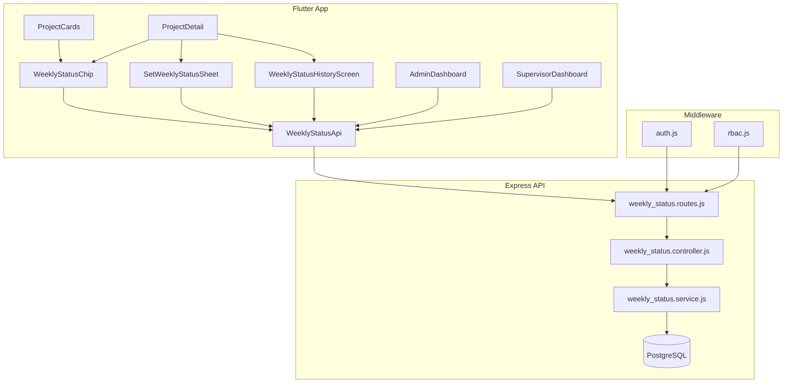
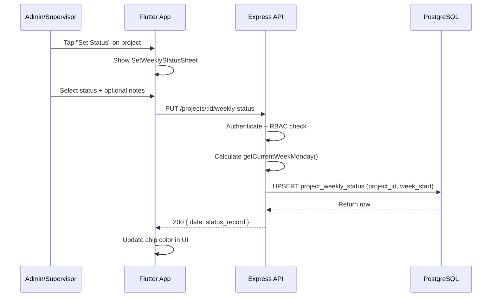
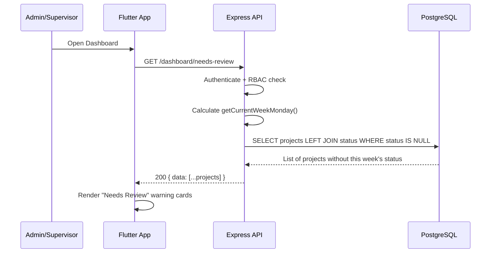

# Design Document: Weekly Project Status

## Overview

The Weekly Project Status feature adds a 3-state health indicator (🔴 Slow / 🟡 Normal / 🟢 On Track) to every project in the ICMS Work Management system. Admin or Supervisor users set a project's weekly health once per week on a Monday-reset cycle. The status is displayed as a color-coded chip across all dashboards, project cards, and detail screens — giving instant visibility into project health without drilling into reports.

Status does not auto-expire; it persists until a new one is set. Projects lacking a current-week status surface in a "Needs Review" dashboard section.

## Architecture



## Sequence Diagrams

### Set Weekly Status Flow



### Dashboard Needs Review Flow



## Components and Interfaces

### Component 1: Database Schema (Migration 040)

**Purpose**: Store weekly health status per project with upsert semantics.

```sql
CREATE TABLE IF NOT EXISTS project_weekly_status (
  id          UUID PRIMARY KEY DEFAULT gen_random_uuid(),
  project_id  UUID NOT NULL REFERENCES projects(id) ON DELETE CASCADE,
  status      VARCHAR(10) NOT NULL CHECK (status IN ('on_track', 'normal', 'slow')),
  notes       VARCHAR(200),
  set_by      UUID NOT NULL REFERENCES users(id) ON DELETE SET NULL,
  week_start  DATE NOT NULL,
  created_at  TIMESTAMPTZ NOT NULL DEFAULT now(),
  UNIQUE (project_id, week_start)
);

CREATE INDEX IF NOT EXISTS idx_pws_project_week ON project_weekly_status(project_id, week_start DESC);
CREATE INDEX IF NOT EXISTS idx_pws_set_by ON project_weekly_status(set_by);
```

**Responsibilities**:
- Enforce one status per project per week via UNIQUE constraint
- Enable fast lookup by project + week
- Cascade delete when project is removed

### Component 2: Backend Service (weekly_status.service.js)

**Purpose**: Business logic for weekly status operations.

**Interface**:
```javascript
// weekly_status.service.js
module.exports = {
  getCurrentWeekMonday,      // () => Date (ISO string, always Monday)
  getProjectCurrentStatus,   // (projectId) => StatusRecord | null
  getProjectStatusHistory,   // (projectId, limit) => StatusRecord[]
  setProjectStatus,          // (projectId, userId, userRole, { status, notes }) => StatusRecord
  getAllProjectsCurrentStatus, // () => Map<projectId, StatusRecord>
  getProjectsNeedingReview,  // (userId, userRole) => Project[]
};
```

**Responsibilities**:
- Calculate the Monday of the current week (week_start anchor)
- Upsert status using INSERT ... ON CONFLICT
- Scope supervisor queries to their assigned projects
- Return projects missing a current-week status

### Component 3: Backend Controller (weekly_status.controller.js)

**Purpose**: HTTP request handling and response formatting.

```javascript
// weekly_status.controller.js
module.exports = {
  getCurrentStatus,    // GET /projects/:id/weekly-status
  getHistory,          // GET /projects/:id/weekly-status/history
  setStatus,           // PUT /projects/:id/weekly-status
  weeklyOverview,      // GET /dashboard/weekly-overview
  needsReview,         // GET /dashboard/needs-review
};
```

**Responsibilities**:
- Parse request params and body
- Call service methods
- Format JSON responses with `{ data: ... }` envelope
- Handle validation errors (missing status, invalid value)

### Component 4: Backend Routes (weekly_status.routes.js)

**Purpose**: Express router wiring with auth and RBAC middleware.

```javascript
// Mounted at '/' (declares absolute paths)
router.get('/projects/:id/weekly-status', controller.getCurrentStatus);
router.get('/projects/:id/weekly-status/history', requireRole('admin', 'supervisor'), controller.getHistory);
router.put('/projects/:id/weekly-status', requireRole('admin', 'supervisor'), controller.setStatus);
router.get('/dashboard/weekly-overview', requireRole('admin'), controller.weeklyOverview);
router.get('/dashboard/needs-review', requireRole('admin', 'supervisor'), controller.needsReview);
```

**Responsibilities**:
- Enforce role-based access per endpoint
- Register under `'/'` base (declares full paths like other modules)

### Component 5: Flutter WeeklyStatusModel

**Purpose**: Data class for status records.

```dart
class WeeklyStatusModel {
  final String id;
  final String projectId;
  final String status; // 'on_track', 'normal', 'slow'
  final String? notes;
  final String setBy;
  final String? setByName;
  final DateTime weekStart;
  final DateTime createdAt;

  WeeklyStatusModel.fromJson(Map<String, dynamic> json);
  Map<String, dynamic> toJson();
}
```

### Component 6: Flutter WeeklyStatusApi

**Purpose**: HTTP client for weekly status endpoints using existing DioClient.

```dart
class WeeklyStatusApi {
  final Dio _dio = DioClient.instance;

  Future<WeeklyStatusModel?> getCurrentStatus(String projectId);
  Future<List<WeeklyStatusModel>> getHistory(String projectId);
  Future<WeeklyStatusModel> setStatus(String projectId, String status, String? notes);
  Future<Map<String, WeeklyStatusModel>> getWeeklyOverview();
  Future<List<Map<String, dynamic>>> getNeedsReview();
}
```

### Component 7: Flutter WeeklyStatusChip Widget

**Purpose**: Reusable color-coded chip for displaying status.

```dart
class WeeklyStatusChip extends StatelessWidget {
  final String? status; // null = no status set
  final bool compact;   // true for list cards, false for detail

  // Colors: on_track=green, normal=amber, slow=red, null=grey
}
```

### Component 8: Flutter SetWeeklyStatusSheet

**Purpose**: Bottom sheet for admin/supervisor to set/update weekly status.

```dart
class SetWeeklyStatusSheet extends StatefulWidget {
  final String projectId;
  final String? currentStatus;
  final String? currentNotes;

  // Shows 3 radio cards (On Track / Normal / Slow) + notes field (200 char limit)
}
```

## Data Models

### Model 1: project_weekly_status (Database)

| Column | Type | Constraints |
|--------|------|-------------|
| id | UUID | PK, gen_random_uuid() |
| project_id | UUID | FK projects(id), NOT NULL |
| status | VARCHAR(10) | CHECK IN ('on_track','normal','slow'), NOT NULL |
| notes | VARCHAR(200) | nullable |
| set_by | UUID | FK users(id), NOT NULL |
| week_start | DATE | NOT NULL, always a Monday |
| created_at | TIMESTAMPTZ | NOT NULL, DEFAULT now() |

**Validation Rules**:
- status must be one of: 'on_track', 'normal', 'slow'
- notes max 200 characters
- week_start must be a Monday (enforced by service logic)
- (project_id, week_start) is unique — one status per project per week

### Model 2: API Response Envelope

```javascript
// Success response
{ "data": { ...statusRecord } }

// List response
{ "data": [ ...statusRecords ] }

// Overview response (map)
{ "data": { "projectId1": {...}, "projectId2": {...} } }
```

## Key Functions with Formal Specifications

### Function: getCurrentWeekMonday()

```javascript
function getCurrentWeekMonday() {
  const now = new Date();
  const day = now.getDay(); // 0=Sun, 1=Mon, ...
  const diff = day === 0 ? 6 : day - 1;
  const monday = new Date(now);
  monday.setDate(now.getDate() - diff);
  return monday.toISOString().slice(0, 10); // 'YYYY-MM-DD'
}
```

**Preconditions:**
- System clock is available and returns valid date

**Postconditions:**
- Returns a string in 'YYYY-MM-DD' format
- The returned date is always a Monday
- The returned date is within the current ISO week

### Function: setProjectStatus(projectId, userId, userRole, { status, notes })

```javascript
async function setProjectStatus(projectId, userId, userRole, { status, notes }) {
  // Validate status
  if (!['on_track', 'normal', 'slow'].includes(status)) {
    throw ApiError.badRequest('Invalid status');
  }
  // Validate notes length
  if (notes && notes.length > 200) {
    throw ApiError.badRequest('Notes max 200 characters');
  }
  // RBAC: supervisor can only set own projects
  if (userRole === 'supervisor') {
    const assigned = await isUserAssignedToProject(userId, projectId);
    if (!assigned) throw ApiError.forbidden('Not assigned to this project');
  }
  // Upsert
  const weekStart = getCurrentWeekMonday();
  const { rows } = await query(
    `INSERT INTO project_weekly_status (project_id, status, notes, set_by, week_start)
     VALUES ($1, $2, $3, $4, $5)
     ON CONFLICT (project_id, week_start)
     DO UPDATE SET status = $2, notes = $3, set_by = $4, created_at = now()
     RETURNING *`,
    [projectId, status, notes || null, userId, weekStart]
  );
  return rows[0];
}
```

**Preconditions:**
- `projectId` exists in projects table
- `userId` exists in users table
- `userRole` is 'admin' or 'supervisor'
- `status` is one of 'on_track', 'normal', 'slow'
- `notes` is null or string with length <= 200

**Postconditions:**
- Exactly one row exists in project_weekly_status for (projectId, currentWeekMonday)
- The row's status, notes, and set_by match the provided arguments
- If supervisor, the user is verified as assigned to the project
- Returns the upserted record

**Loop Invariants:** N/A (no loops)

### Function: getProjectsNeedingReview(userId, userRole)

```javascript
async function getProjectsNeedingReview(userId, userRole) {
  const weekStart = getCurrentWeekMonday();
  let scopeClause = '';
  const params = [weekStart];

  if (userRole === 'supervisor') {
    params.push(userId);
    scopeClause = `AND p.id IN (
      SELECT project_id FROM project_assignments WHERE user_id = $${params.length}
    )`;
  }

  const { rows } = await query(
    `SELECT p.id, p.project_name, p.project_code
     FROM projects p
     WHERE p.id NOT IN (
       SELECT project_id FROM project_weekly_status WHERE week_start = $1
     )
     ${scopeClause}
     ORDER BY p.project_name`,
    params
  );
  return rows;
}
```

**Preconditions:**
- `userRole` is 'admin' or 'supervisor'
- If supervisor, `userId` is valid

**Postconditions:**
- Returns only projects that have NO status entry for the current week
- If supervisor, results are scoped to their assigned projects
- Results are sorted by project name

## Example Usage

### Backend: Setting a status

```javascript
// PUT /projects/:id/weekly-status
// Body: { "status": "on_track", "notes": "All milestones on schedule" }
// Headers: Authorization: Bearer <jwt>

const result = await weeklyStatusService.setProjectStatus(
  req.params.id,
  req.user.id,
  req.user.role,
  { status: req.body.status, notes: req.body.notes }
);
// result: { id, project_id, status: 'on_track', notes: '...', set_by, week_start, created_at }
```

### Frontend: Displaying the chip

```dart
// In a project card
WeeklyStatusChip(status: project.weeklyStatus, compact: true);

// In project detail header
WeeklyStatusChip(status: statusModel?.status, compact: false);
```

### Frontend: Setting status

```dart
// Show bottom sheet
showModalBottomSheet(
  context: context,
  builder: (_) => SetWeeklyStatusSheet(
    projectId: project.id,
    currentStatus: currentStatus?.status,
    currentNotes: currentStatus?.notes,
  ),
);
```

## Error Handling

### Error 1: Invalid Status Value

**Condition**: Request body contains status not in ['on_track', 'normal', 'slow']
**Response**: 400 Bad Request with `{ error: { code: 'BAD_REQUEST', message: 'Invalid status' } }`
**Recovery**: Client shows validation error, user selects valid option

### Error 2: Supervisor Setting Non-Assigned Project

**Condition**: Supervisor attempts to set status for project they're not assigned to
**Response**: 403 Forbidden with `{ error: { code: 'FORBIDDEN', message: 'Not assigned to this project' } }`
**Recovery**: Client shows permission error, supervisor can only set their own projects

### Error 3: Notes Too Long

**Condition**: Notes field exceeds 200 characters
**Response**: 400 Bad Request with `{ error: { code: 'BAD_REQUEST', message: 'Notes max 200 characters' } }`
**Recovery**: Client enforces maxLength on text field (200 chars)

### Error 4: Project Not Found

**Condition**: Project ID in URL does not exist
**Response**: 404 Not Found
**Recovery**: Client navigates back or refreshes project list

## Testing Strategy

### Unit Testing Approach

- Test `getCurrentWeekMonday()` with various dates (weekdays, weekends, edge of year)
- Test `setProjectStatus()` validation logic (invalid status, long notes, RBAC)
- Test `getProjectsNeedingReview()` scoping logic
- Mock database queries to isolate business logic

### Property-Based Testing Approach

**Property Test Library**: fast-check (JavaScript)

- Monday calculation always returns a Monday regardless of input date
- Upsert idempotence: setting same status twice for same week yields same result
- RBAC invariant: supervisor scope is always a subset of admin scope

### Integration Testing Approach

- Test full API flow with real database
- Verify RBAC enforcement across all endpoints
- Test UNIQUE constraint behavior with concurrent requests
- Verify cascade delete when project is removed

## Security Considerations

- JWT authentication required for all endpoints
- RBAC middleware enforces role-based access
- Supervisor scope enforced at service level (not just middleware)
- Notes field sanitized (max length, no SQL injection via parameterized queries)
- No PII exposed in status records beyond set_by user ID

## Correctness Properties

*A property is a characteristic or behavior that should hold true across all valid executions of a system — essentially, a formal statement about what the system should do. Properties serve as the bridge between human-readable specifications and machine-verifiable correctness guarantees.*

### Property 1: Monday calculation invariant

*For any* date (any day of the week, any month, any year), calling getCurrentWeekMonday() SHALL return a string in 'YYYY-MM-DD' format that represents a Monday, and that Monday is within the same ISO week as the input date.

**Validates: Requirements 2.1, 2.2, 2.4**

### Property 2: Upsert idempotence

*For any* project and any week, setting a status multiple times SHALL always result in exactly one Status_Record for that (project_id, week_start) pair, with the most recently submitted values for status, notes, and set_by.

**Validates: Requirements 1.2, 3.1, 3.2**

### Property 3: Invalid status rejection

*For any* string value that is not one of 'on_track', 'normal', or 'slow', attempting to set that value as a project status SHALL be rejected with a validation error.

**Validates: Requirements 1.4, 3.5**

### Property 4: Notes length enforcement

*For any* string longer than 200 characters submitted as notes, the system SHALL reject the request with a validation error.

**Validates: Requirements 1.5, 3.6**

### Property 5: Supervisor scope is a subset of admin scope

*For any* supervisor user, the set of projects they can set status for SHALL be a subset of the projects an admin can set status for. Specifically, a supervisor can only set status for projects they are assigned to, while an admin can set status for all projects.

**Validates: Requirements 3.3, 3.4, 6.2**

### Property 6: Needs review correctness

*For any* set of projects and status records, the needs-review list SHALL contain exactly those projects that have no Status_Record for the current week, scoped by user role, and ordered alphabetically by project name.

**Validates: Requirements 6.1, 6.2, 6.3**

### Property 7: History ordering

*For any* project with multiple status records, requesting the status history SHALL return records sorted by week_start in descending order (most recent first).

**Validates: Requirements 4.2, 10.3**

### Property 8: Status-to-color mapping determinism

*For any* status value, the WeeklyStatusChip SHALL map it to exactly one color: 'on_track' → green, 'normal' → amber, 'slow' → red, null → grey. This mapping is total and deterministic.

**Validates: Requirements 8.3, 8.4, 8.5, 8.6**

## Dependencies

- **Backend**: express, pg (existing), uuid via gen_random_uuid() (existing)
- **Frontend**: dio (existing DioClient singleton), flutter Material widgets
- **No new packages required** — built entirely with existing dependencies
